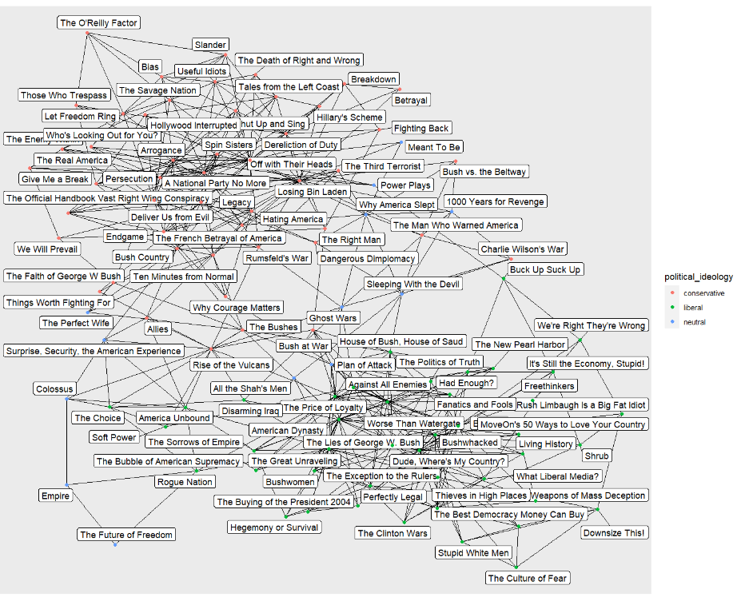
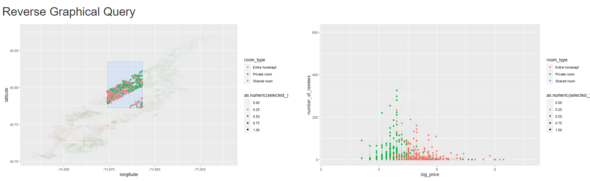
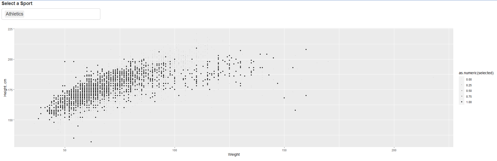

```{r setup, include=FALSE}
knitr::opts_chunk$set(warnings = FALSE, message = FALSE)
library(ggplot2)
library(tidyverse)
library(tidygraph)
library(dplyr)
library(feasts)
library(tsibble)
library(dplyr)
library(ggraph)
library(ggforce)
library(patchwork)
library(sf)
library(raster)
library(terra)
# library(shiny)
```


### 1. [Bike Demand] 
This problem asks you to visualize a [dataset](https://uwmadison.box.com/shared/static/f16jmkkskylfl1hnd5rpslzduja929g2.csv) of hourly bikeshare demand. Provide your code and make sure it is readable.

```{r}
bike <- read.csv("https://uwmadison.box.com/shared/static/f16jmkkskylfl1hnd5rpslzduja929g2.csv")
head(bike)
```
a. Make a line plot of bike demand (`count`) by hour, faceted out across the 7 days of the week (`weekday`).
    
```{r}

line_plot <-  ggplot(bike) +
  geom_line(aes(x = hr, y = count, group = dteday)) +
  facet_wrap(~ weekday)

line_plot
```

b. Create a new summary data.frame giving the 25 and 75 percent quantiles of demand (`count`) for each hour (`hr`) by day of the week (`weekday`) combination, separately within each year (`yr`) that the data was collected.
    
```{r}
new_summary <- bike %>%
  group_by(yr,weekday,hr) %>%
  summarise(q25 = quantile(count,0.25,na.rm = TRUE),
            q75 = quantile(count,0.75,na.rm = TRUE))

new_summary
```

c. Using a ribbon plot, overlay the quantities from (b) onto your plot from part (a). Use color to distinguish between the ribbons for the first and second year that the data were collected.
```{r}

line_plot +
  geom_ribbon(data = new_summary, 
              aes(x = hr, ymin = q25, ymax = q75, fill = as.factor(yr))) +
  scale_fill_manual(values = c("red", "blue"))
```
   
d. Provide a brief description of some takeaways from the final visualization.
    
For weekdays, there are two strong cyclics at about 7:30 a.m and 17:30 p.m., which corresponds to people's work hours.
During weekend, usage dema    nd gradually increases in the morning, reaches its peak at noon, and then gradually              decreases.


### 2. [CalFresh Enrollment I] 
In this problem, we will investigate spatial and temporal aspects of enrollment in CalFresh, a nutritional assistance program in California.
    
a. The code below reads in the CalFresh data. We've filtered out February 2019,
since benefits were distributed differently in this month, leading to outliers
for most counties. Extract features of the `calfresh` time series using the
`features` function in the feasts library.
    
```{r}
library(tsibble)
calfresh <- read.csv("https://uwmadison.box.com/shared/static/rduej9hsc4w3mdethxnx9ccv752f22yr.csv") %>%
  filter(date != "2019 Feb") %>%
  mutate(date = yearmonth(date)) %>%
  as_tsibble(key = county, index = date)

calfresh 
```

```{r}
calf <- calfresh %>%
  features(calfresh,feature_set(pkgs ='feasts')) %>%
  left_join(calfresh,by = "county")

calf
```
    
b. Visualize CalFresh enrollment over time for the counties with the highest and
lowest `seasonal_strength_year`.
```{r}
calf %>%
  filter(seasonal_strength_year == max(seasonal_strength_year)) %>%
  pull(county) -> highest_county

calf %>%
  filter(seasonal_strength_year == min(seasonal_strength_year)) %>%
  pull(county) -> lowest_county

Calfresh_enrollment <- calf %>%
  filter(county %in% c(highest_county,lowest_county)) %>%
  ggplot(aes(x = date, y = calfresh, color = county)) +
  geom_line() +
  labs(x = "time", y = "calfresh enrollment",
       title = "calfresh enrollment over time for the counties with the highest and
    lowest `seasonal_strength_year`")

Calfresh_enrollment
```

    
c. The code below reads in a vector dataset demarcating the county boundaries in
California. Join in the features dataset from (a) with this these vector data.
Use this to produce a map with each county shaded in by its `seasonal_strength_year`.
    
```{r}
library(sf)
counties <- read_sf("https://uwmadison.box.com/shared/static/gropucqxgqm82yhq13do1ws9k16dnxq7.geojson")
joint_calf <- left_join(counties,calf,by = "county")
joint_calf
```
```{r}
ggplot(joint_calf) +
  geom_sf(aes(fill = seasonal_strength_year,geometry = geometry),
          col = "black", lwd = 0.2, lty = 2) +
  scale_fill_gradient(low = "white",high = "steelblue") +
  labs(title = "Seasonal strength year")
```
  
  
  
    d. Propose, but do not implement, a visualization of this dataset that makes use
    of dynamic queries. What questions would the visualization answer? What would be
    the structure of interaction, and how would the display update when the user
    provides a cue?
    
    As a spatial and temporal data set, visualization of it can answer question like 
    the background of certain county, how the enrollment of this program change over 
    time in certain county. The users can choose those county that they want to explore 
    on the map, and a line plot and a table will show information of chosen county.
    
    
### 3. [Political Book Recommendations] 
In this problem, we'll study a network
dataset of Amazon bestselling US Politics books. Books are linked by an edge if
they appeared together in the recommendations ("customers who bought this book
also bought these other books").
    
a. The code below reads in the edges and nodes associated with the network.
The edges dataset only contains IDs of co-recommended books, while the nodes
data includes attributes associated with each book. Build a `tbl_graph`
object to store the graph.
    
```{r}
edges <- read_csv("https://raw.githubusercontent.com/krisrs1128/stat679_code/main/activities/week10/political-books-edges.csv", col_types = "cci")
nodes <- read_csv("https://raw.githubusercontent.com/krisrs1128/stat679_code/main/activities/week10/political-books-nodes.csv", col_types = "ccc")
```
    
    
```{r}
graph <- tbl_graph(nodes, edges, directed = FALSE)
graph
```
    
b. Use the result from part (a) to visualize the network as a node-link
diagram. Include the book's title in the node label, and shade in the node
according to political ideology.
```{r}
nodes
```
    
    
    
```{r}
# ggraph(graph,layout = "kk") +
#   geom_edge_link() +
#   geom_node_label(aes(label = nodes$label),repel = TRUE) +
#   geom_node_point(aes(color = political_ideology))
```
Due to the limitation of figure size, the screenshot of the figure is as follows:

    
    
c. Create the analogous adjacency matrix visualization. Provide examples of
visual queries that are easy to answer using one encoding but not the other
(i.e., what is easy to see in the node-link view vs. what is easy to see in
the adjacency matrix).
    
The visualization is as follows. One example query is that whether it is an
inner group or structure within each political ideology. From the output below,
there are two or three groups within "conservative" books. And for "liberal"
books, there is one big group. Another interesting finding is that from the 
visualization of the adjacency matrix, books labeled with "neutral" are
less likely to connected with each other.
    
```{r}
ggraph(graph, "matrix") +
  geom_node_point(aes(col = political_ideology), x = -1) +
  geom_node_point(aes(col = political_ideology), y = 1) +
  geom_edge_tile(mirror = TRUE) +
  scale_y_reverse() +
  scale_color_brewer(palette = "Set1") +
  labs(title = "Amazon bestselling US Politics books")
  coord_fixed()
```


### 4. [NYC Rentals] 
In this problem, we'll create a visualization to dynamically query a
[dataset](https://uwmadison.box.com/shared/static/zi72ugnpku714rbqo2og9tv2yib5xped.csv)
of Airbnb rentals in Manhattan in 2019. The steps below guide you through the
process of building this visualization.
    
a. Make a scatterplot of locations (Longitude vs. Latitude) for all the rentals,
colored in by `room_type`.
    
```{r}
NYCrentals <- read.csv("https://uwmadison.box.com/shared/static/zi72ugnpku714rbqo2og9tv2yib5xped.csv")
head(NYCrentals)
```

```{r, fig.width=8, fig.height=6}
ggplot(NYCrentals) +
  geom_point(aes(x = longitude, y = latitude, col = room_type),size = 1)
```

    
    
b. Design a plot and a dynamic query so that clicking or brushing on the
plot updates the points that are highlighted in the scatterplot in (a). For
example, you may query a histogram of prices to focus on neighborhoods that
are more or less affordable.
    
A scatter plot of log_price and reviews_per_month. Users can brush on the plot
to choose those apartment they are interested in, and the scatter plot will
highlight those chosen apartment.
    
c. Implement the reverse graphical query. That is, allow the user to update
the plot in (b) by brushing over the scatterplot in (a).
    
```{r}

# reset_selected <- function(df, brush) {
#   brushedPoints(df,brush,allRows = TRUE)$selected_
# }
# 
# scatter_plot <- function(df,selected, xvar, yvar) {
#   df %>% 
#     mutate(selected_ = selected) %>%
#     ggplot(aes_string(x = xvar, y = yvar)) +
#     geom_point(aes(alpha = as.numeric(selected_), col = room_type)) +
#     scale_alpha_continuous(range = c(0.01,1))
# }
# 
# 
# ui <- fluidPage(
#   titlePanel("Reverse Graphical Query"),
#   
#   fluidRow(
#     column(6, plotOutput("scatter1", brush = "plot_brush")),
#     column(6, plotOutput("scatter2", brush = "plot_brush"))
#   )
# )
# 
# server <- function(input, output) {
#   selected <- reactiveVal(rep(TRUE,nrow(NYCrentals)))
#   
#   observeEvent(
#     input$plot_brush,
#     selected(reset_selected(NYCrentals,input$plot_brush))
#   )
#   
#   output$scatter1 <- renderPlot(
#     scatter_plot(NYCrentals,selected(), xvar = "longitude", yvar = "latitude")
#   )
#   output$scatter2 <- renderPlot(
#     scatter_plot(NYCrentals,selected(), xvar = "log_price", yvar = "number_of_reviews")
#   )
# }
# 
# shinyApp(ui, server)
```

    
d. Comment on the resulting visualization(s). If you had a friend who was
interested in renting an Airbnb in NYC, what would you tell them?
    
They can choose rentals within certain range of price and how popular the 
rantals are, then they can know the location of chosen rooms. To sum up, the 
shiny app above provide a way that users can choose certain range of price, 
and visit or rent the most popular rantal.
    
###5. [Geospatial Datasets] 
For each of the datasets below, specify whether it is in a vector or raster 
data format. If it is in a vector data format, explain which types of geometries
it contains (e.g., a point or linestring). Explain your reasoning.
  
a. [NYC Building Footprints](https://uwmadison.box.com/shared/static/qfmrp9srsoq0a7oj0e7xmgu5spojr33e.geojson)
   
This dataset is a vector dataset which contains polygons information. we can use 
st_geometry_type function to check which type of geometries this dataset contains.
Another reason is that the dataset is stored in .geojson file.
```{r}
NYC <- read_sf("https://uwmadison.box.com/shared/static/qfmrp9srsoq0a7oj0e7xmgu5spojr33e.geojson")
NYC
```
    
b. [Africa Population 2020](https://github.com/krisrs1128/stat479_s22/blob/main/_slides/week7/exercises/data/afripop2020.tif?raw=true)
    
It is a raster dataset, which is stored in .tif file. We can also find the 
data format by the decription below.
    
```{r}
Africa <- rast("https://github.com/krisrs1128/stat479_s22/blob/main/_slides/week7/exercises/data/afripop2020.tif?raw=true")
Africa
```
    
    
c. [Himalayan Glacial Lakes](https://github.com/krisrs1128/stat479_s22/tree/main/_slides/week7/exercises/data/glacial_lakes)
It is a vector data set in polygon format, because in geometry column it contains "polygon"
    
```{r}
Himalayan <- read_sf("C:\\Users\\12927\\Desktop\\visiting\\Courses\\STAT 436\\hw3\\glacial_lakes\\glacial_lakes\\GL_3basins_2015.shp")
Himalayan
```
    
    
d. [US EV Charging ](https://raw.githubusercontent.com/krisrs1128/stat479_s22/main/_slides/week7/exercises/data/ev.geojson)
    
This is a dataset in point format according to the decription below. Also, another reason is that the dataset is stored in .geojson file.
    
```{r}
US <- read_sf("https://raw.githubusercontent.com/krisrs1128/stat479_s22/main/_slides/week7/exercises/data/ev.geojson")
US
```
    
  
e. [Zion Elevation](https://github.com/krisrs1128/stat479_s22/blob/main/_slides/week7/exercises/data/landsat.tif?raw=true)
This is a raster dataset which is stored in .tif file. Another reason is as following code.
    
```{r}
Zion <- rast("https://github.com/krisrs1128/stat479_s22/blob/main/_slides/week7/exercises/data/landsat.tif?raw=true")
Zion
```
    
    
    
###6. [Olympics Interactive App] 
The code below sets up a Shiny app for interactively visualizing athlete weight and heights 
in the 2012 London Olympics. We would like to have an interactive scatterplot of `Weight` vs.
`Height, cm` that updates which points (athletes) are highlighted depending on
which sports have been selected by a dropdown menu. Code for generating the
scatterplot is provided in the function `scatterplot`.
    
```{r}
# library(shiny)
# library(tidyverse)
# olympics <- read.csv("https://uwmadison.box.com/shared/static/rzw8h2x6dp5693gdbpgxaf2koqijo12l.csv")
# 
# #' Scatterplot with highlighted points
# #'
# #' Assumes a column in df called "selected" saying whether points should be
# #' larger / darker
# scatterplot <- function(df) {
#   ggplot(df) +
#     geom_point(aes(
#       Weight,
#       Height..cm,
#       alpha = as.numeric(selected),
#       size = as.numeric(selected)
#     )) +
#     scale_alpha(range = c(0.05, .8)) +
#     scale_size(range = c(0.1, 1))
# }
# 
# ui <- fluidPage(
#   selectInput(
#     "dropdown",
#     "Select a Sport",
#     choices = unique(olympics$Sport),
#     multiple = TRUE
#   ),
#   plotOutput("scatterplot")
# )
# 
# server <- function(input, output) {
#   # fill this in...
#   
#   output$scatterplot <- renderPlot({olympics %>%
#                                      mutate(selected = Sport %in% input$dropdown) %>%
#                                      scatterplot()})
# }
```
    
    
    
a. Provide server code which would allow the scatterplot to update
the highlighted athletes depending on the currently selected sports.
    

```{r}
# shinyApp(ui,server)
```
    
b. We have been asked to also print a table of the selected athletes.
Assume the UI has the form,
        
    ```{r}
    # ui <- fluidPage(
    #   selectInput("dropdown", "Select a Sport", choices = unique(olympics$Sport), multiple = TRUE),
    #   plotOutput("scatterplot"),
    #   dataTableOutput("table") 
    # )
    ```
    
Describe changes to your solution to (a) to meet the new requirements. How
would you minimize code duplication? Be as specific as possible.
    
1. Add an reactive expression to dynamically select the required athletes.
2. use "renderTable" function to ouput the result of the table.
Brief Code:
    
```{r}
# server <- function(input, output) {
#   ### other code ###
#   selected_athlete <- reactive ({
#     olympics %>%
#       mutate(selected = Sport %in% input$dropdown)
#   })
#   ### other code ###
#   
#   output$table <- renderTable(selected_athlete)
#   ### other code ###
# }
```

```{r,include=FALSE}
options(tinytex.verbose = TRUE)
```

